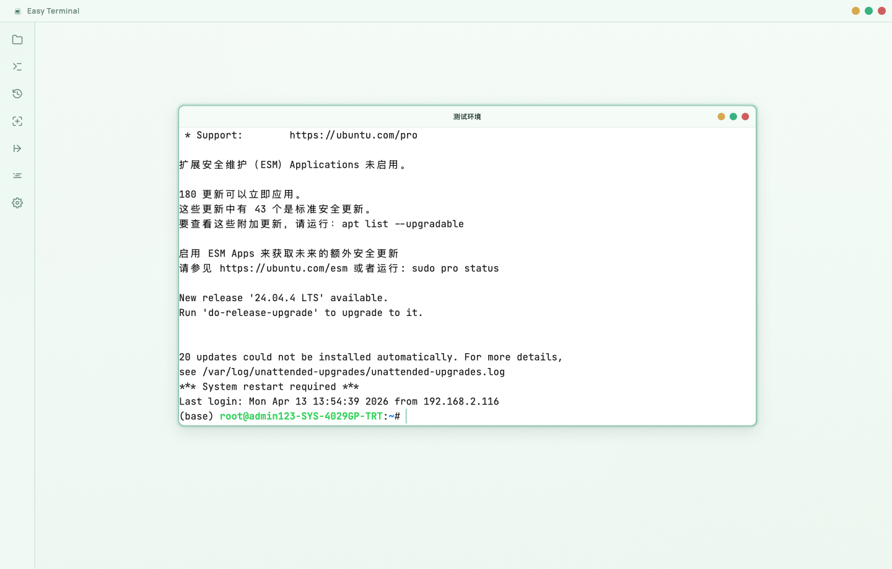
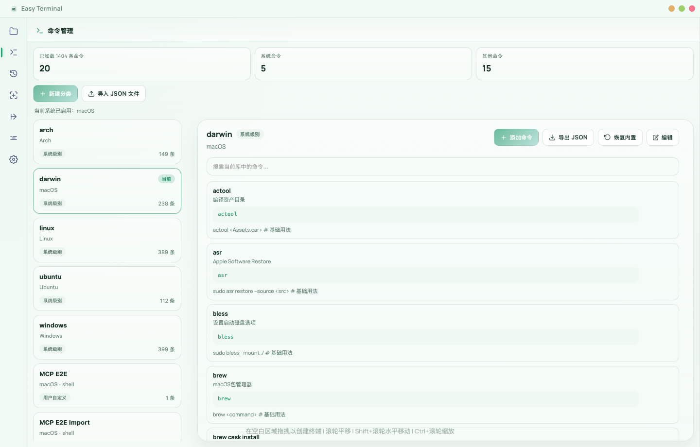
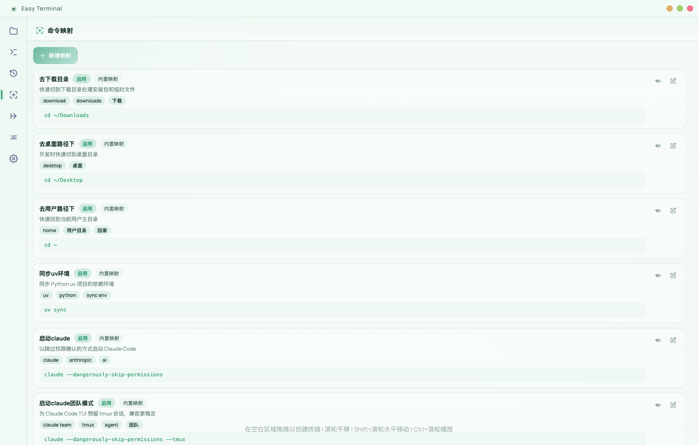
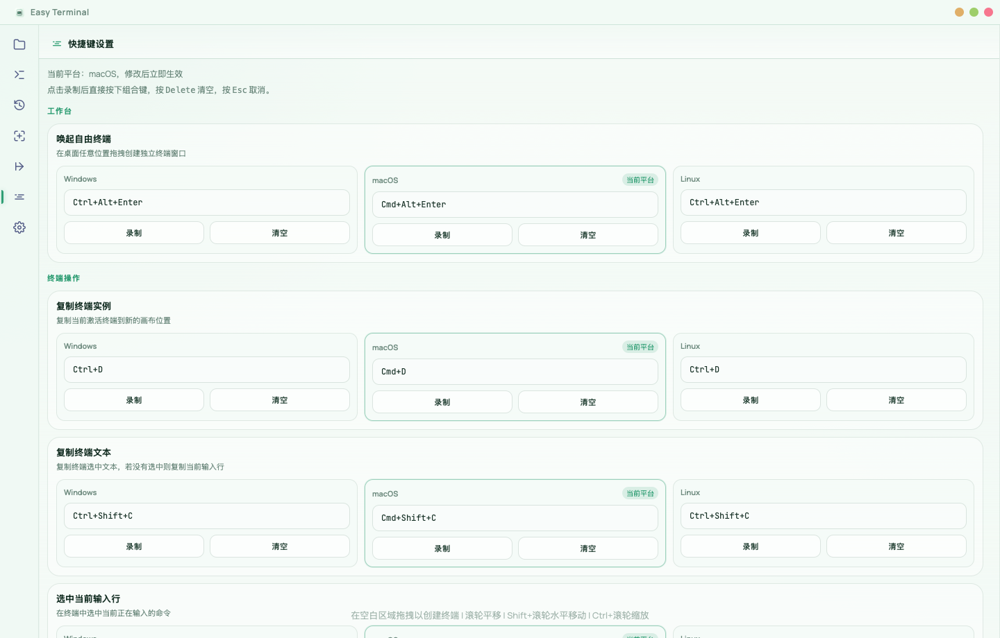
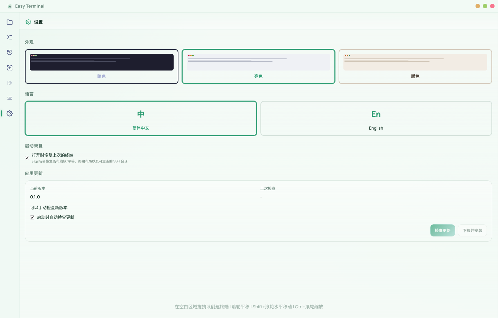

# Easy Terminal

Easy Terminal 是一个面向本地开发者的桌面终端工作台，基于 `Tauri 2 + Vanilla TypeScript + Rust + xterm.js` 构建。它把传统终端拆成可拖拽、可缩放、可复制的画布窗口，同时把 SSH 远程、命令知识库、历史回放、命令映射、全局快捷键和自动更新整合到一个跨平台桌面应用里。

## 核心能力

- 终端画布
  将终端作为窗口卡片放在无限画布中，可拖拽、缩放、最大化、最小化、复制和对齐。
- 自由画布终端
  通过全局快捷键拉起桌面绘制模式，在任意屏幕区域直接框选生成独立终端窗口。
- SSH 远程管理
  内置 SSH 配置面板，支持密码/密钥登录、跳板机链路、远程目录浏览和连接测试。
- 命令智能补全
  输入时聚合系统命令、内置命令库、历史命令、命令映射和 SSH 服务器配置进行联想。
- 命令知识库
  内置和自定义命令库统一检索，可查看用法、示例、别名和分类信息。
- 历史与映射
  历史命令可直接复用；高频操作可沉淀成映射，支持中文触发和命令执行分离。
- 文件与远程文件浏览
  本地文件树和远程文件访问统一在应用内完成，支持从终端上下文同步到文件面板。
- 快捷键与更新
  所有关键操作可配置快捷键；发布版本支持 GitHub Releases 自动更新。

## 截图导览

### 1. 终端画布

主画布支持多终端并行、拖拽布局、缩放和平移，适合把本地 shell、远程 shell 和传输任务放在同一个工作面板里。



### 2. 文件管理

文件管理面板可浏览本地目录，支持排序、筛选，并能和当前终端上下文联动。


### 3. 自由画布独立终端

通过全局快捷键进入自由画布后，可以直接在桌面框选区域生成无边框独立终端窗口，适合临时拉起 SSH、日志或构建任务。


### 4. 命令库

命令库面板提供系统命令、内置模板和自定义命令的统一管理入口，适合整理团队常用操作。



### 5. 历史命令

历史命令按时间和使用次数沉淀，可以直接再次发送到当前激活终端。


### 6. 命令映射

命令映射允许把自然语言或业务短语映射到真实命令，用于沉淀高频操作。



### 7. SSH 配置中心

SSH 配置支持主机分组、账号、端口、密钥路径、跳板机关系和连接测试。


### 8. SSH 自动补全

当输入 `ssh` 时，补全列表会直接带出已配置服务器，并在回车时自动生成完整连接命令。


### 9. 快捷键配置

快捷键中心支持跨平台分别配置，尤其适合自由画布和终端复制粘贴等高频操作。



### 10. 设置面板

设置页支持主题、语言、启动恢复和常用行为开关。



## 适合的使用场景

- 本地开发时同时维护多个服务进程
- 运维/测试时并排管理多台 Linux 服务器
- 将常用 SSH、systemctl、docker、git 等命令沉淀成可搜索资产
- 在一个桌面工作区中同时完成连机、传文件、查历史和执行命令

## 技术栈

- 前端：Vanilla TypeScript、Vite、xterm.js、CodeMirror
- 桌面壳：Tauri 2
- 后端：Rust
- 远程连接：`ssh2`
- 数据存储：SQLite（命令库 / 历史 / 本地配置）

## 本地开发

### 环境要求

- Node.js 20+
- pnpm 9+
- Rust stable
- Tauri 2 构建环境

### 启动开发模式

```bash
pnpm install
pnpm tauri dev
```

### 常用命令

```bash
pnpm build
pnpm typecheck
pnpm tauri build
pnpm build:mac
pnpm build:mac-arm
pnpm build:mac-intel
pnpm build:windows
pnpm build:linux
```

## License

如需开源发布，建议补充明确的许可证文件，例如 `MIT` 或 `Apache-2.0`。
